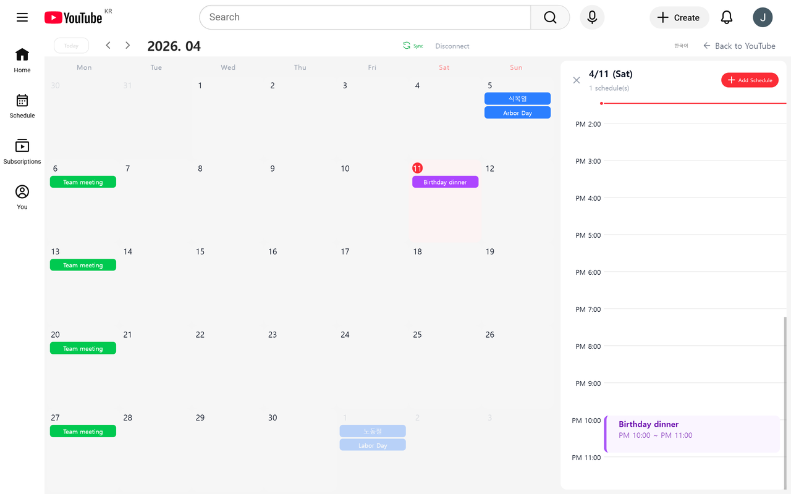
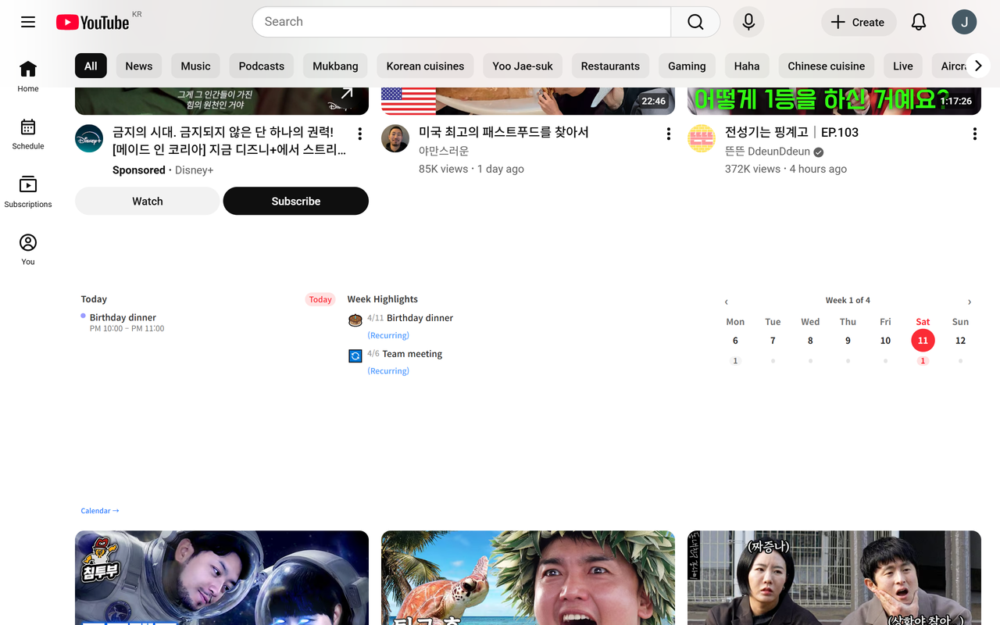

# ShortScheduler

> YouTube Shorts를 스케줄러로 교체하는 Chrome 확장프로그램

YouTube Shorts에 접근하는 순간, 쇼츠 영상 대신 오늘의 일정을 확인하고 새로운 할 일을 추가할 수 있습니다. 단순히 차단하는 것이 아니라 **생산적인 대체재**를 제공합니다.

[](https://chromewebstore.google.com/)
[](LICENSE)


---

## 스크린샷

### 월간 캘린더 + 일간 타임라인



Google Calendar 스타일의 월간 뷰. 날짜를 클릭하면 우측에 일간 타임라인 패널이 슬라이드인되고, 시간 슬롯을 클릭해 일정을 추가할 수 있습니다.

### YouTube 홈피드 미니 위젯



YouTube 홈 피드의 Shorts 선반을 주간 캘린더 미니 위젯으로 교체합니다. Today 일정, Week Highlights, 월간 그리드를 한눈에 확인할 수 있습니다.

---

## 주요 기능

- **YouTube Shorts 2단계 차단** — SPA 내부 이동(`history.pushState`) + 직접 URL 접근(`webNavigation`)
- **월간 캘린더 인라인 스케줄러** — YouTube 페이지를 떠나지 않고 오버레이로 표시 (즉시 전환)
- **일간 타임라인 패널** — 시간 슬롯 클릭으로 일정 추가, 폼 입력 중 실시간 미리보기
- **반복 일정** — 매일/매주/매월, 삭제 시 "이 일정만 / 이후 모두 / 전체" 3가지 옵션
- **YouTube 사이드바 미니 위젯** — 모든 YouTube 페이지에서 캘린더 토글
- **Shorts 선반 → 주간 위젯 교체** — MutationObserver로 감지, Shadow DOM으로 주입
- **Google Calendar 연동** — OAuth 인증 후 즉시 자동 동기화, 모든 캘린더(개인/회사/생일) 병렬 로드
- **다국어 지원** — 한국어 / 영어 토글
- **다크 모드** — YouTube 테마 설정 자동 연동

---

## 설치

### Chrome Web Store (권장)

Chrome Web Store에서 "ShortScheduler"를 검색하여 설치하세요.

### 개발자 모드 설치

1. 저장소 클론 후 빌드:
   ```bash
   git clone https://github.com/nodejun/schedule-popup.git
   cd schedule-popup
   npm install
   npm run build
   ```
2. `chrome://extensions` 열기 → 우상단 **개발자 모드** 활성화
3. **압축해제된 확장 프로그램을 로드합니다** 클릭 → `dist/` 폴더 선택

---

## 기술 스택

| 영역        | 기술                                             |
| ----------- | ------------------------------------------------ |
| 플랫폼      | Chrome Extension Manifest V3                     |
| UI          | React 19 + TypeScript 5                          |
| 빌드        | Vite 7 + @crxjs/vite-plugin 2.3                  |
| 스타일      | Tailwind CSS 4 (Shadow DOM `adoptedStyleSheets`) |
| 상태 관리   | zustand 5                                        |
| 스키마 검증 | zod 3                                            |
| 외부 API    | Google Calendar API + Chrome Identity API        |

---

## 아키텍처

```
YouTube 탭
├─ Content Script (ISOLATED World)
│  ├─ Shadow DOM #1 — MiniWidget (주간 캘린더)
│  ├─ Shadow DOM #2 — InlineScheduler (월간 캘린더)
│  └─ Shadow DOM #3 — SidebarWidget
│
├─ MAIN World Script — history.pushState 가로채기
│
└─ Service Worker (Background)
   ├─ webNavigation → /shorts 리다이렉트
   ├─ chrome.identity OAuth 대행
   └─ MAIN World 스크립트 주입

chrome.storage (sync/local) — schedules:YYYY-MM-DD, settings, google-auth
```

### /shorts 차단 전략

1. **SPA 내부 이동**: YouTube 사이드바 Shorts 클릭 시 `history.pushState`를 MAIN World에서 가로채 차단
2. **직접 URL 접근**: 주소창/외부 링크로 `/shorts` 접근 시 `chrome.webNavigation.onBeforeNavigate`로 감지하여 스케줄러 페이지로 리다이렉트

### Shadow DOM 스타일 격리

Tailwind CSS를 `content.css?inline`으로 문자열 임포트 → `CSSStyleSheet` 인스턴스 생성 → `shadowRoot.adoptedStyleSheets`에 할당. YouTube의 전역 CSS와 완전히 격리됩니다.

---

## 개발

```bash
# 개발 서버 (HMR)
npm run dev

# 프로덕션 빌드
npm run build

# 테스트
npm run test
```

### 프로젝트 구조

```
src/
├── background/          # Service Worker
├── content/             # Content Script + Shadow DOM 인젝터
│   ├── injectors/       # MiniWidget, Sidebar, InlineScheduler 인젝터
│   ├── observers/       # YouTube SPA 라우트 감지
│   └── utils/           # DOM 헬퍼, YouTube 셀렉터
├── components/
│   ├── calendar/        # MonthlyCalendar, MonthGrid, DailyDetailPanel
│   ├── schedule/        # ScheduleForm, TimelineView, ScheduleCard
│   └── widget/          # MiniWidget, InlineScheduler, SidebarWidget
├── stores/              # zustand 스토어 (schedule, settings, google-calendar)
├── storage/             # chrome.storage 래퍼 + repository 패턴
├── services/            # Google Calendar API 클라이언트
├── schemas/             # zod 스키마
└── types/               # TypeScript 타입
```

---

## 권한

| 권한                           | 용도                                        |
| ------------------------------ | ------------------------------------------- |
| `storage`                      | 일정 데이터 및 설정 저장                    |
| `scripting`                    | MAIN World에 `pushState` 차단 스크립트 주입 |
| `webNavigation`                | `/shorts` 직접 URL 접근 감지                |
| `identity`                     | Google Calendar OAuth 토큰 발급             |
| `https://www.youtube.com/*`    | YouTube DOM 조작                            |
| `https://www.googleapis.com/*` | Google Calendar API 호출                    |

**데이터 수집 없음** — 모든 일정 데이터는 사용자의 `chrome.storage`와 Google Calendar에만 저장됩니다. 외부 서버로 어떤 데이터도 전송되지 않습니다.

---

## 라이선스

MIT

---

## 문의

- 버그 제보 / 기능 제안: [GitHub Issues](https://github.com/nodejun/schedule-popup/issues)
- 개발자: ksh03196@gmail.com
